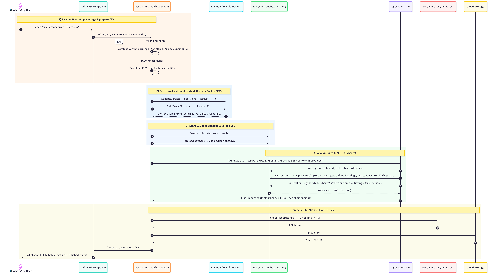

<div align="center">

# 📊 Dash Reports

### *Turn Your Scary CSV Files into Clear Business Insights*

**No SQL. No Spreadsheets. Just WhatsApp.**

</div>

---

## 💬 The Story

My mom runs a small business. Every week, her booking system lets her "Export Report"—which gives her a terrifying **20,000-row CSV file**. 

She doesn't know SQL or Excel formulas, so she just... ignores it. The data sits there, unused.

**SMB owners don't want rows and columns.** They want to know: *"How is my business doing?"*

---

## 💡 The Solution

**Dash Reports** bridges the gap between raw data and actual understanding.

Instead of fighting with software, my mom simply drops that CSV into **WhatsApp**—the app she already uses every day.

Within minutes, an AI agent:
- 📊 Analyzes the entire file (Python, Pandas, SQLite)
- 🌐 Searches the internet for context (local news, industry trends)
- 📈 Generates charts and extracts key metrics
- 📄 Texts back a beautiful, easy-to-read **PDF Memo**

No dashboard login. No complex setup. Just answers.

---

## 🎬 Watch It Work

<div align="center">

[](https://youtu.be/M0tcMI92-yg)

*2-minute demo of the complete flow*

</div>

---

## ✨ What It Does

1. **📤 Send CSV** - Drop any CSV file into WhatsApp
2. **🤖 AI Analyzes** - GPT-4o explores your data in an E2B sandbox
3. **🌐 Adds Context** - Searches the web for relevant trends (via Exa MCP)
4. **📊 Creates Charts** - Generates visualizations automatically
5. **📱 Get PDF** - Receive a beautiful report via WhatsApp

**Example:** "Why did bookings drop in March?" → Agent might find: *"Local festival cancelled that week"*

---

## 🏗️ How It Works

<div align="center">



*Complete workflow: From WhatsApp message to delivered PDF report*

</div>

### The 5 Phases

**1) Receive WhatsApp message & prepare CSV** 📱  
User sends CSV via WhatsApp → Twilio webhook → Next.js downloads file

**2) Enrich with external context (Exa via Docker MCP)** 🌐  
*Optional:* If URLs detected, spins up E2B MCP sandbox → Fetches context from web

**3) Start E2B code sandbox & upload CSV** 🔐  
Creates isolated Python environment → Uploads CSV → Converts to SQLite

**4) Analyze data (KPIs + ≥3 charts)** 📊  
GPT-4o runs multi-step analysis → Computes metrics → Generates visualizations with Matplotlib

**5) Generate PDF & deliver to user** 📄  
Puppeteer renders neobrutalism-styled report → Uploads to Vercel Blob → WhatsApp delivers link

---

**Tech Stack:** E2B Code Interpreter • OpenAI GPT-4o • Exa MCP (Docker) • Next.js • Twilio • Puppeteer

---

## 🚀 Hackathon Requirements

✅ **E2B Code Interpreter** - All Python analysis runs in isolated sandboxes  
✅ **Exa MCP (Docker)** - Web research via E2B MCP gateway  
✅ **Multi-Step Agent** - GPT-4o orchestrates iterative analysis  
✅ **Working Demo** - Fully deployed on Vercel with WhatsApp integration

---

## 🛠️ Setup

**Requirements:** Node.js 18+, API keys (all have free tiers)

```bash
# Clone and install
git clone https://github.com/yourusername/E2B-Hackathon.git
cd E2B-Hackathon
npm install

# Add API keys to .env.local
cp env.example .env.local
# Edit .env.local with your keys

# Deploy
vercel --prod
```

**API Keys Needed:**
- E2B → [e2b.dev](https://e2b.dev) (free $100 credits)
- OpenAI → [platform.openai.com](https://platform.openai.com)
- Exa → [exa.ai](https://exa.ai) (free 1000 searches)
- Twilio → [twilio.com](https://twilio.com) (free trial)
- Vercel Blob → Auto-created after deploying

**Configure Twilio Webhook:**  
Set WhatsApp webhook to: `https://your-app.vercel.app/api/webhook`

---


## 🚀 Future Enhancements

### 🎨 **Dynamic PDF Generation Inside E2B**

**Current approach:** PDF is generated on Vercel with fixed neobrutalism template

**Planned improvement:** Move PDF generation entirely into E2B sandbox with AI-driven layouts

**Benefits:**
- 📊 **Adaptive Layouts**: Report structure matches data type (timeline, regional, categorical)
- 🎨 **Contextual Styling**: Formal reports vs casual summaries based on user tone
- 🖼️ **Better Chart Placement**: AI decides optimal chart positioning per insight
- ⚡ **All in Sandbox**: No external PDF service needed—everything stays in E2B
- 🎯 **Industry Templates**: Auto-detect industry (retail, hospitality, SaaS) and apply appropriate formatting


---

## 🔗 Links

📺 **Demo Video**: [https://youtu.be/M0tcMI92-yg](https://youtu.be/M0tcMI92-yg)  
📚 **E2B Docs**: [e2b.dev/docs](https://e2b.dev/docs)  
🏆 **Hackathon**: [E2B MCP Agents Hackathon](https://luma.com/0vm36r4q?tk=QxjbLk)

---

<div align="center">

**Built with ❤️ for the E2B Hackathon**

*Making data accessible to small business owners everywhere*

</div>

